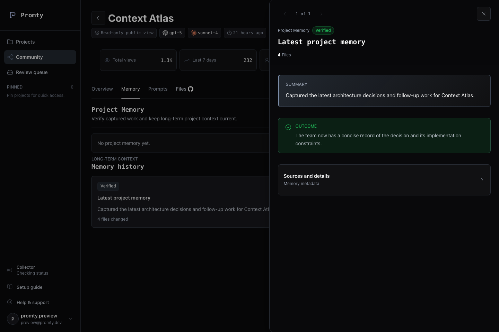

<p align="center">
  
</p>

<h1 align="center">Promty</h1>

<p align="center">
  <strong>Your AI tools can read the code. Promty remembers why it became this code.</strong>
</p>

<p align="center">
  Durable, reviewable project memory for AI-assisted software development.
</p>

<p align="center">
  <a href="https://promty.org">Website</a>
  ·
  <a href="#quick-start">Quick start</a>
  ·
  <a href="./docs/memory-architecture.md">Architecture</a>
  ·
  <a href="./docs/development-guidelines.md">Contributing</a>
</p>

---

AI coding sessions are good at the work in front of them. They are much worse at
carrying forward the reasoning that shaped a project:

- Why was this architecture chosen?
- Which approaches were tried and rejected?
- What is still unresolved?
- What should the next human or agent do first?

Promty captures completed work from supported AI coding tools and compiles it into
structured **Project Memory**. The result is not another transcript archive. It is a
concise, source-linked context layer that you can review before the next session uses it.

> **The core promise:** stop re-explaining the project and continue with the decision
> trail intact.

<p align="center">
  
</p>

## How it works

| | Stage | What Promty does | What you get |
|---:|---|---|---|
| **01** | **Capture** | Collects completed work only from repositories where you install Promty. | Repository-scoped development history |
| **02** | **Compile** | Extracts outcomes, decisions, rejected paths, open questions, and next instructions. | Human-reviewable Project Memory |
| **03** | **Continue** | Makes the latest reviewed memory available through the CLI and read-only MCP. | Context ready for the next human or agent |

```text
Codex CLI / Claude Code
          │
          ▼
   repository hooks
          │
          ▼
   local durable queue
          │
          ▼
 FastAPI + PostgreSQL
          │
          ▼
  reviewable memory
       ┌──┴──┐
       ▼     ▼
      CLI   MCP
```

## Why Promty

### Remember decisions, not just messages

Chat histories preserve what was said. Promty organizes what future work needs:
current direction, important decisions, rejected alternatives, unresolved questions,
and the next instruction.

### Move between tools without starting over

Project context should belong to the project, not to one model or chat window. Promty
creates a tool-independent memory layer for Codex CLI, Claude Code, and future agents.

### Keep humans in control

Generated memory is reviewable. Collection is enabled repository by repository, and the
Agent Context bridge is owner-scoped and read-only.

## Quick start

### Requirements

- Node.js 20+
- Python 3.12+
- A Git repository

Run the setup command from the repository you want Promty to remember:

```bash
npx promty-collector init --tool codex-cli
```

Setup opens Promty sign-in, stores a revocable collector credential on your machine,
installs repository-local hooks, and starts the background uploader.

For Claude Code:

```bash
npx promty-collector init --tool claude-code
```

Check the local installation:

```bash
promty doctor --tool codex-cli
```

After Project Memory has been generated and reviewed, read it from the repository:

```bash
promty context
promty context --format json
```

Promty installs hooks only in the repository where `init` runs. Run the command again
inside every additional repository you explicitly want to connect.

## Agent Context bridge

Promty can provide the latest reviewed Project Memory to an MCP-compatible coding agent.
Configure the client to start:

```json
{
  "command": "promty",
  "args": ["mcp"]
}
```

The server exposes one owner-scoped, read-only tool:

```text
get_project_context
```

It returns the latest Project Memory as Markdown and structured JSON. It cannot modify
the project or write back into memory. See the [Agent Context guide](./docs/agent-context.md)
for details.

## What gets captured

Promty normalizes tool-specific hook payloads into a stable event model:

```text
SessionStarted
PromptSubmitted
ResponseReceived
FilesChanged
CommitCreated
SessionEnded
```

The currently installable integrations are:

| Tool | Status |
|---|---|
| Codex CLI | Adapter, repository hooks, and real payload path validated |
| Claude Code | Adapter and repository hook installer implemented |
| Cursor | Experimental; not exposed by setup commands |
| Gemini CLI | Experimental; not exposed by setup commands |

If a connected repository has a GitHub `origin`, Promty links the captured project to
that repository automatically. SSH and HTTPS GitHub remote formats are supported.

## Trust boundaries

Promty is designed around explicit collection and review:

- **Selected repositories only.** Unrelated projects are not scanned automatically.
- **Durable local queue.** Hook execution does not depend on backend availability.
- **Separate credentials.** Browser sessions and collector ingestion use different tokens.
- **Encrypted sensitive text.** Raw prompt, response, and unified diff text is encrypted at rest.
- **Owner-scoped context.** Private Project Memory is returned only to its owner.
- **Read-only agent access.** MCP can retrieve reviewed memory but cannot change it.
- **Immediate privacy changes.** Switching a public project back to private removes its public access.

Project and session metadata, timestamps, file paths, line counts, and status fields
remain queryable for organization and diagnostics. Derived memory artifacts should not be
treated as a general-purpose secret store. See [Memory Architecture](./docs/memory-architecture.md)
and [Event Specification v1](./docs/event-spec-v1.md) for the full boundaries.

## Architecture

```text
promty/
├── collector/       Local CLI, adapters, hooks, queue, uploader, and MCP server
├── backend/         FastAPI application, workers, SQLAlchemy models, and Alembic
├── frontend/        React workspace, public pages, and administrator console
├── docs/            Architecture, operations, security, and development guides
├── docker/          Local Compose configuration
└── infra/aws/       Production AWS configuration and validation scripts
```

The collector converts each supported tool payload into **Promty Event v1** before it
reaches the backend. The backend does not need to understand raw Codex or Claude payloads.
Events are uploaded idempotently, persisted in PostgreSQL, and compiled asynchronously
into memory artifacts.

For a deeper view, start with:

- [Memory Architecture](./docs/memory-architecture.md)
- [Agent Context bridge](./docs/agent-context.md)
- [Event Specification v1](./docs/event-spec-v1.md)
- [Artifact Model](./docs/artifact-model.md)
- [Database schema](./docs/database.md)

## Local development

Start PostgreSQL, migrations, backend workers, API, and frontend:

```bash
docker compose up --build
```

Then open:

```text
Frontend        http://127.0.0.1:5173
API readiness   http://127.0.0.1:8011/health/ready
```

To run application processes on the host while keeping PostgreSQL in Docker:

```bash
docker compose up -d postgres
./.venv/bin/alembic -c backend/alembic.ini upgrade head
```

Run the API and Project Memory worker in separate terminals:

```bash
cd backend
../.venv/bin/uvicorn app.main:app --host 127.0.0.1 --port 8011
```

```bash
cd backend
../.venv/bin/python -m app.workers.project_memory
```

Compose loads development defaults from `docker/compose.env` and applies overrides from
the ignored root `.env.local` when present. Copy configuration names from
[`docs/promty.env.example`](./docs/promty.env.example).

## Testing

With the Compose stack running:

```bash
cd backend && PROMTY_RUN_POSTGRES_TESTS=1 ../.venv/bin/pytest -q
cd frontend && npm test
cd frontend && npm run test:e2e
```

CI runs Python static checks, backend and collector tests, collector package validation,
and the frontend production build.

## Operations

Promty includes an administrator console at `/admin` for system health, users, projects,
memory jobs, security posture, audit logs, support inquiries, and bilingual marketing
content operations.

Production deployment uses GitHub Actions with AWS services including S3, CloudFront,
ECR, EC2, Systems Manager, and PostgreSQL. Operational details and sensitive configuration
belong in the dedicated runbooks rather than this README:

- [AWS and GitHub deployment](./docs/aws-github-deployment.md)
- [AWS resource inventory](./docs/aws-resource-inventory.md)
- [Backend optimization plan](./docs/backend-optimization-plan.md)
- [Support inquiries](./docs/support-inquiries.md)
- [Marketing content studio](./docs/marketing-content-studio.md)

## Collector reference

Profiles isolate credentials, queues, logs, and uploader processes between environments:

```bash
npx promty-collector init --tool codex-cli --profile dev
npx promty-collector init --tool codex-cli --profile prod
npx promty-collector init --tool codex-cli --profiles dev,prod
```

Verify multiple targets:

```bash
npx promty-collector doctor --profiles dev,prod --tool codex-cli
```

Automatic updates are opt-in. Pass `--auto-update` to `init` or `start-uploader` when you
want the background process to check npm periodically. Otherwise update explicitly:

```bash
npx promty-collector@latest init --tool codex-cli --profile prod
```

Useful maintenance commands:

```bash
promty install-hooks --tool codex-cli
promty install-hooks --tool claude-code
promty uninstall-hooks --tool claude-code
promty upload --api-url http://127.0.0.1:8011
promty doctor
```

The default local runtime lives under `~/.promty`. Events are queued by project and
session at:

```text
~/.promty/events/<project_id>/<session_id>/events.jsonl
```

## Documentation

| Guide | Purpose |
|---|---|
| [Project status](./docs/project-status.md) | Current implementation snapshot and local runbook |
| [Development guidelines](./docs/development-guidelines.md) | Branch, commit, module, and verification rules |
| [Collector verification](./docs/codex-hook-verification.md) | Real Codex hook smoke path |
| [Memory architecture](./docs/memory-architecture.md) | Project Memory model and roadmap |
| [Agent Context](./docs/agent-context.md) | CLI and MCP context retrieval |
| [Artifact model](./docs/artifact-model.md) | Generated and reviewed memory artifacts |
| [Database](./docs/database.md) | PostgreSQL schema and migrations |
| [Deployment](./docs/aws-github-deployment.md) | AWS and GitHub Actions production runbook |

---

<p align="center">
  <strong>Capture the work. Preserve the reasoning. Continue with intent.</strong>
</p>
